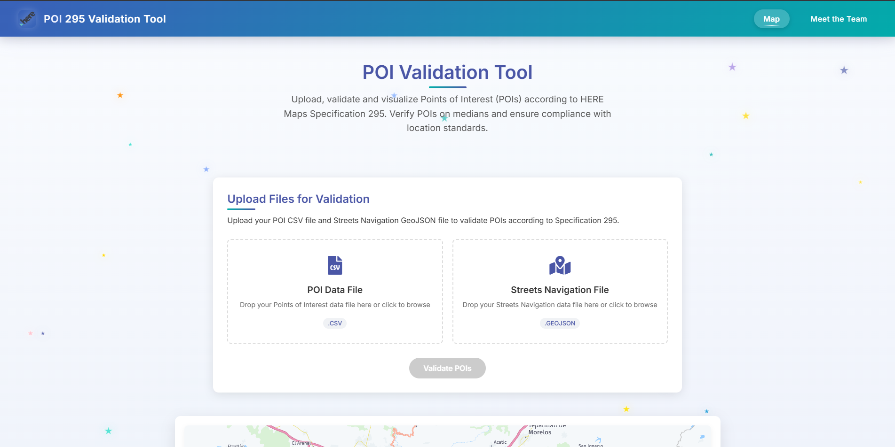

# POI 295 Validation Tool - Frontend

## 📋 Overview

This is the frontend application for the POI 295 Validation Tool, developed for the **Guadalahacks 2025** hackathon. It provides an intuitive interface for uploading POI data and visualizing validation results based on HERE Maps Specification 295.



## ✨ Features

- **Modern UI**: Clean, responsive interface following HERE Maps design language
- **Interactive Map**: Visualization of POIs and validation results
- **File Upload**: Drag-and-drop interface for CSV and GeoJSON files
- **Team Page**: Meet the developers behind this project
- **Animated Background**: Custom visual elements for an engaging user experience

## 🚀 Quick Start

### Development Environment

1. Install dependencies:
   ```bash
   npm install
   ```

2. Set up environment variables:
   Create a `.env` file in the frontend directory with:
   ```
   REACT_APP_HERE_API_KEY=your_api_key_here
   REACT_APP_API_URL=http://localhost:5000
   ```

3. Start the development server:
   ```bash
   npm start
   ```

4. The application will be available at [http://localhost:3000](http://localhost:3000)


## 🧩 Application Structure

```
frontend/
├── public/                  # Static files
│   ├── index.html          # HTML template
│   ├── favicon.ico         # App icon
│   └── ...
│
├── src/                     # Source code
│   ├── assets/             # Static assets
│   │   └── images/         # Image files including team photos
│   │
│   ├── components/         # React components
│   │   ├── Map/            # Map-related components
│   │   │   ├── HEREMapComponent.jsx  # HERE Maps integration
│   │   │   └── ...
│   │   │
│   │   ├── Team/           # Team page components
│   │   │   └── TeamPage.jsx          # Team showcase
│   │   │
│   │   ├── UI/             # UI components
│   │   │   ├── Navbar.jsx             # Navigation bar
│   │   │   ├── Footer.jsx             # Page footer
│   │   │   └── BackgroundEffect.jsx   # Animated background
│   │   │
│   │   └── Upload/         # File upload components
│   │       └── FileUploadSection.jsx  # File upload interface
│   │
│   ├── services/           # Service integrations
│   │   └── HereMapService.js         # HERE Maps SDK utilities
│   │
│   ├── App.js              # Main application component
│   ├── index.js            # Application entry point
│   └── index.css           # Global styles
│
├── .dockerignore           # Docker ignore file
├── Dockerfile              # Docker configuration
├── package.json            # Dependencies and scripts
└── README.md               # This documentation
```

## 🧠 Key Concepts

### Component Architecture

The application uses a modular component architecture:

- **Container Components**: Manage state and data flow
- **Presentational Components**: Focus on UI rendering
- **Service Modules**: Handle external API communication
- **Shared UI Components**: Reusable UI elements

### Styling Approach

We use styled-components for styling:

- **Component-scoped styles**: CSS encapsulated within components
- **Theme consistency**: HERE Maps color palette and design language
- **Responsive design**: Mobile-first approach with appropriate breakpoints
- **Animation**: Subtle animations and transitions for an engaging experience

### HERE Maps Integration

The map integration is handled through:

- **HEREMapService.js**: Manages HERE Maps JavaScript SDK loading and initialization
- **HEREMapComponent.jsx**: React component that renders and interacts with the map
- **Dynamic script loading**: Asynchronously loads HERE Maps SDK when needed

## 👩‍💻 Development Guide

### Adding New Components

1. Create a new component in the appropriate directory:
   ```jsx
   // src/components/Example/NewComponent.jsx
   import React from 'react';
   import styled from 'styled-components';

   const Container = styled.div`
     /* Your styles here */
   `;

   const NewComponent = ({ prop1, prop2 }) => {
     return (
       <Container>
         {/* Component content */}
       </Container>
     );
   };

   export default NewComponent;
   ```

2. Import and use the component where needed:
   ```jsx
   import NewComponent from './components/Example/NewComponent';
   
   // Then in your render method or return statement:
   <NewComponent prop1="value" prop2={42} />
   ```

### Working with HERE Maps

To add new map functionality:

1. Add methods to `src/services/HereMapService.js`:
   ```javascript
   export const newMapFunction = (map, ...params) => {
     // Implementation
   };
   ```

2. Import and use in map components:
   ```javascript
   import { newMapFunction } from '../../services/HereMapService';
   
   // Then in your component:
   newMapFunction(mapInstance, param1, param2);
   ```

### File Upload & Backend Integration

The file upload process:

1. User selects or drops files in the `FileUploadSection` component
2. Files are sent to the backend using `axios` for HTTP requests
3. Backend processes files and returns validation results
4. Results are displayed on the map

## 🌐 Environment Variables

| Variable | Description | Default |
|----------|-------------|---------|
| `REACT_APP_HERE_API_KEY` | HERE Maps API Key | - |
| `REACT_APP_API_URL` | Backend API URL | http://localhost:5000 |

## 📦 Dependencies

Major dependencies include:

- **react**: UI library
- **react-router-dom**: Page routing
- **styled-components**: CSS-in-JS styling
- **axios**: HTTP client

Dev dependencies:

- **@testing-library/react**: Testing utilities
- **react-scripts**: Build scripts and configuration


## 🔄 CI/CD Integration

This project can be set up with:

- **Docker Hub**: For container registry integration

## 🌟 Best Practices

This project follows these best practices:

- **Component Composition**: Building complex UIs from simple components
- **Controlled Components**: Forms with React-managed state
- **Proper Error Handling**: Graceful error management and user feedback
- **Responsive Design**: Works on devices of all sizes
- **Accessibility**: ARIA attributes and keyboard navigation
- **Code Splitting**: Lazy loading for improved performance
- **Performance Optimization**: Memoization and optimized rendering
